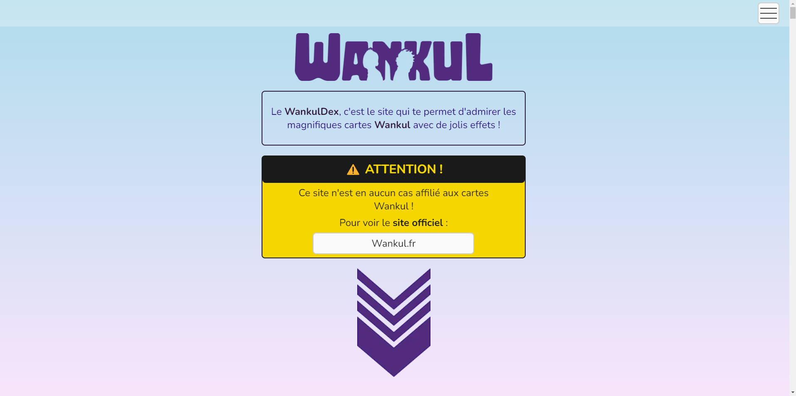
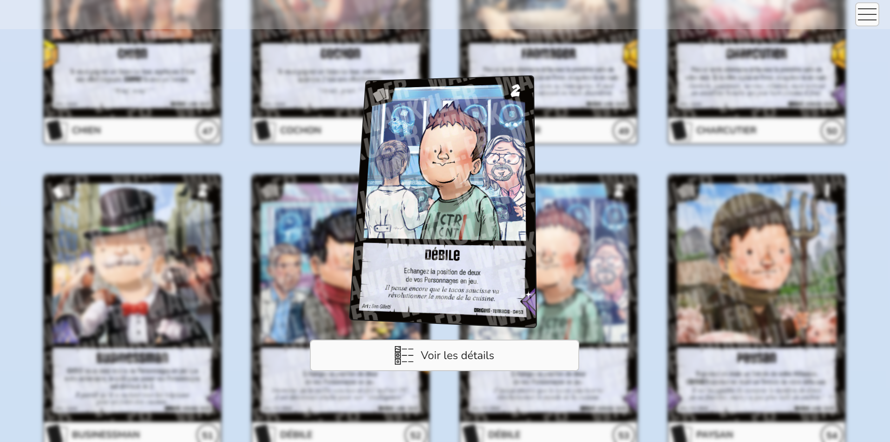
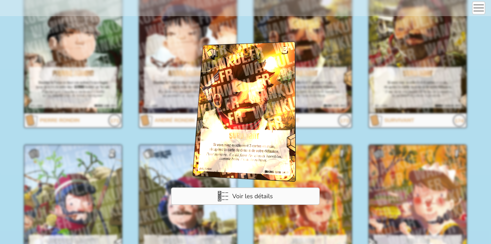
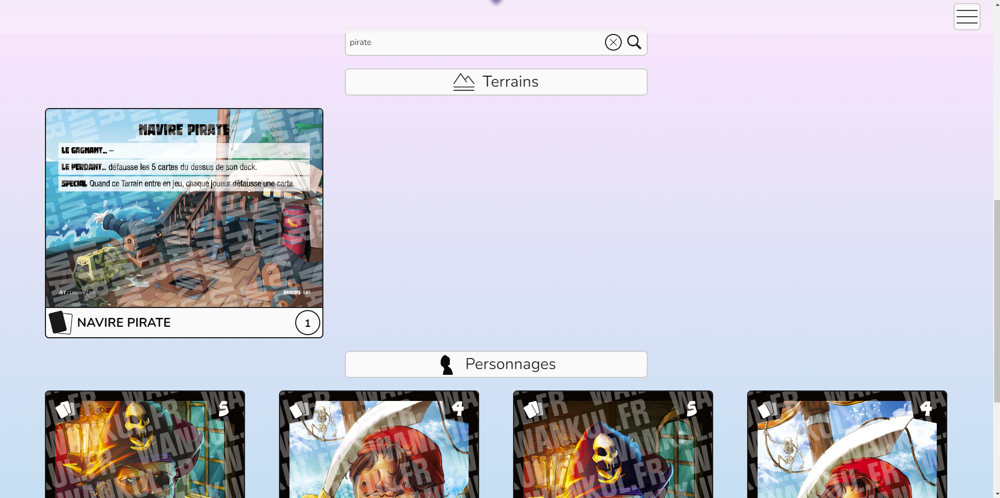
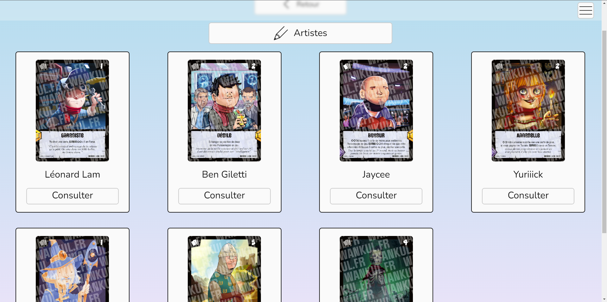
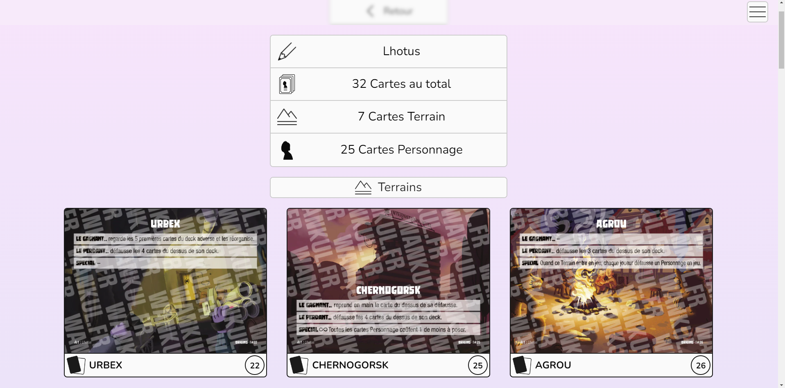
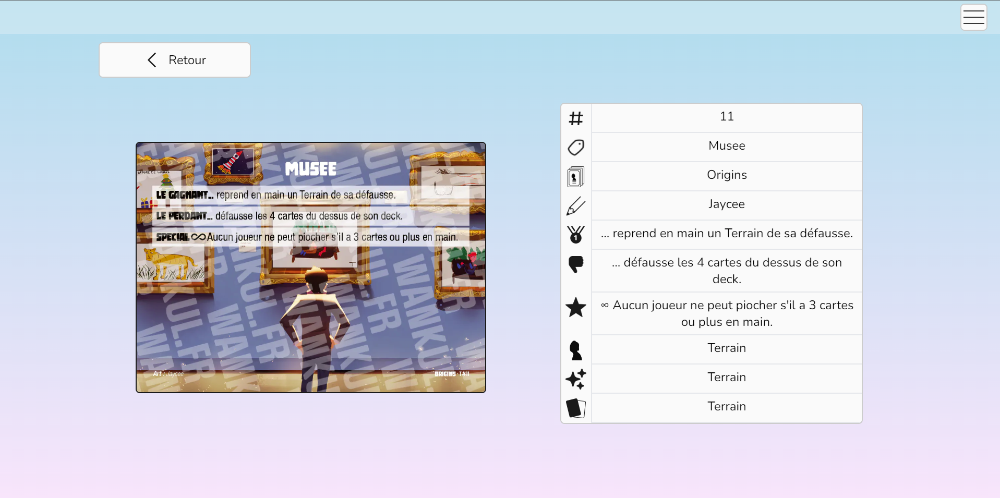

# 🎴 WankulDex
The Wankuldex is a website allowing you to see and manipulate Wankul cards.

Wankul cards are created by Wankil Studio, a duo of French streamers and youtubers, and based on their characters, named Wankuls.

#### ⚠️The site is currently only available in French for the subtitles and section titles, but it will not prevent you from enjoying the cards.

### You can see the working site at [Wankuldex](https://wankuldex.timeuh.fr).

## 🗔 What you can do
### 🏠 Home page
When you go on the site, you land in the home page (logic), where you will see a disclaimer about Wankul cards and their creators.

*Wankul copyright disclaimer*


Below, you will be able to see and preview every Wankul card, sorted on their type : field or character card.

When clicking a card, you will see a preview with the card image and a button to go to details page of this card.

You will be able to move your mouse on the card image and see it move, and sometimes shine depending on its rarity.
#### ⚠️ Only working on desktop !

*Normal Character card preview*


*Legendary Character shining card preview*


On this page, you can also search one or many cards, and the list will be filtered.
Here, we look for all pirate cards :

*Search function*


### 📝 Card attributes list pages
On these pages, you will be able to see all possible attributes based on your choice of page : artist, character, type of card or rarity.

Here is when you visit the artists page :

*Artist list page*


On this page, you can choose an artist and go see a summary of his participation and all the cards he/she drew.

### 📇 Card attribute details pages
On these pages you will see the artist, rarity, character or type summary of the number of cards belonging to it, and see the list of these cards.

Here is the summary of an artist :

*Summary of artist Lhotus cards*


### 🪪 Card details page
When clicking a card, you see a preview. On this preview, you can click to go see the details of this card.

This page shows you all the details of a given card, to read things like card citation, effect or collection.

*Field card details page*


## 📟 Tech stack
This is my first Next Js project, so it was tough to familiarize with concepts such as ``server-side rendering``.

I loved using all the tools provided by Next Js like the ```app``` directory for routing, which is great.

Below is the list of all the techs I used for the project :


Fullstack React framework


Query state management in React


Javascript type safety


Utility-first CSS framework


Javascript schema validation


Javascript linting


Project code style

## ©️ Credits
All Wankul cards rights belongs to Wankil Studio. I do not own any of the designs or information used in this project.

Thanks to Laink and Terracid of Wankil Studio for allowing me to make this project.

All the code is produced by Timeuh.